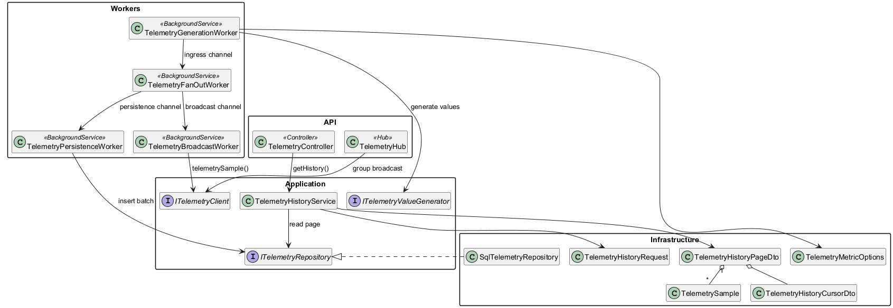
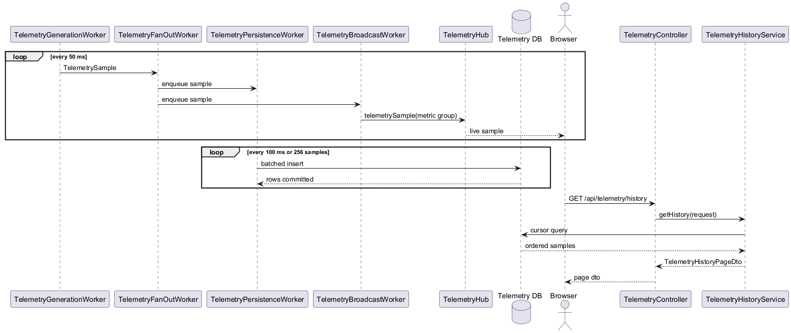

# Backend Telemetry Platform Detailed Design

## Overview
This feature provides one backend path for live and historical telemetry:

1. Generate live telemetry every 50 ms.
2. Persist every generated sample in the database.
3. Publish each generated sample to SignalR subscribers.
4. Serve historical pages through controller endpoints using stable cursor pagination.

The design is intentionally small. Each concern is a single vertical slice with one primary class owning it. The backend uses ASP.NET Core controllers, hosted services, `Microsoft.Extensions.*` infrastructure, and SignalR.





## Radically Simple Shape
- `BackgroundService` generates telemetry.
- `Channel<T>` decouples generation, persistence, and broadcast.
- Controller handles historical retrieval.
- SQL storage is append-only.
- SignalR hub publishes one metric stream per group.

## Vertical Slices For ATDD

### Slice 1. Deterministic Telemetry Generation
**Goal**  
The backend produces one sample every 50 ms for each configured metric.

**ATDD**
- Given the application is started
- When `TelemetryGenerationWorker` runs for 5 seconds
- Then it emits about 100 samples for one metric
- And each sample has a unique `sampleId`
- And each sample timestamp is monotonic in UTC

**Notes**
- Use `PeriodicTimer` with a 50 ms cadence
- Use `TimeProvider` so cadence and timestamps are testable
- Generator only creates values; it does not know about SignalR or SQL

### Slice 2. Durable Append-Only Persistence
**Goal**  
Generated samples are written to the database without slowing the generator.

**ATDD**
- Given the generator emits samples continuously
- When `TelemetryPersistenceWorker` batches up to 256 samples or 100 ms of data
- Then the worker writes the batch in one repository call
- And all emitted samples are persisted in timestamp order for that metric

**Notes**
- `Channel<TelemetrySample>` between generator and persistence uses `BoundedChannelFullMode.Wait`
- Persistence is the durable path and must not drop samples
- Repository performs batched inserts

### Slice 3. Cursor-Based History Retrieval
**Goal**  
The API returns deterministic historical pages with no offset paging.

**ATDD**
- Given persisted telemetry exists for one metric
- When the client calls `GET /api/telemetry/history`
- Then the controller returns ordered samples and continuation cursors
- And the page can be replayed without duplicates or gaps when the next cursor is used

**Notes**
- Order key is `metricId`, `timestampUtc`, `sampleId`
- Query shape is index-friendly and does not use `OFFSET`
- Response includes both `previousCursor` and `nextCursor` where relevant

### Slice 4. Live SignalR Broadcast
**Goal**  
Subscribers receive live samples as soon as they are generated, without waiting for database flush.

**ATDD**
- Given a client has joined the SignalR group for one metric
- When a new sample is generated
- Then `TelemetryBroadcastWorker` publishes the sample to that group
- And the client receives it before the next generator tick in steady state

**Notes**
- Broadcast path is separate from the persistence path
- Under transient broadcast pressure, persistence stays correct
- Group name format: `metric:{metricId}`

## Storage Design

### Table
`TelemetrySamples`

| Column | Type | Notes |
| --- | --- | --- |
| `MetricId` | `nvarchar(128)` | Partitioning and query key at the application level. |
| `TimestampUtc` | `datetime2(7)` | Event time in UTC. |
| `SampleId` | `uniqueidentifier` | Tie-breaker for duplicate timestamps and cursor stability. |
| `Value` | `float` | Numeric telemetry value. |
| `CreatedUtc` | `datetime2(7)` | Insert time for audit and diagnostics. |

### Indexes
- Clustered primary key on `MetricId, TimestampUtc, SampleId`
- Optional nonclustered index on `TimestampUtc` for retention and maintenance jobs

### Cursor Query Shape
For `Older`:
```sql
SELECT TOP (@PageSize + 1) MetricId, TimestampUtc, SampleId, Value
FROM TelemetrySamples
WHERE MetricId = @MetricId
  AND (
    TimestampUtc < @CursorTimestampUtc
    OR (TimestampUtc = @CursorTimestampUtc AND SampleId < @CursorSampleId)
  )
ORDER BY TimestampUtc DESC, SampleId DESC;
```

For `Newer`:
```sql
SELECT TOP (@PageSize + 1) MetricId, TimestampUtc, SampleId, Value
FROM TelemetrySamples
WHERE MetricId = @MetricId
  AND (
    TimestampUtc > @CursorTimestampUtc
    OR (TimestampUtc = @CursorTimestampUtc AND SampleId > @CursorSampleId)
  )
ORDER BY TimestampUtc ASC, SampleId ASC;
```

The controller reverses `Older` pages before returning them so every response is ascending.

## HTTP And SignalR Contracts

### Controller Endpoint
`GET /api/telemetry/history?metricId={metricId}&pageSize={pageSize}&direction={Older|Newer}&cursorTimestampUtc={timestamp?}&cursorSampleId={sampleId?}`

### SignalR Hub
- Hub: `TelemetryHub`
- Server pushes method: `telemetrySample`
- Group subscription method: `SubscribeMetric(string metricId)`
- Group unsubscribe method: `UnsubscribeMetric(string metricId)`

## Classes, Interfaces, Enums, Types

| Name | Kind | Responsibility |
| --- | --- | --- |
| `TelemetryGenerationWorker` | `BackgroundService` | Emits synthetic telemetry on a fixed cadence and writes samples to the ingress channel. |
| `ITelemetryValueGenerator` | Interface | Generates the numeric value for a metric and timestamp. Lets tests replace the waveform logic. |
| `TelemetryFanOutWorker` | `BackgroundService` | Reads ingress samples and forwards them to the persistence queue and broadcast queue. |
| `TelemetryPersistenceWorker` | `BackgroundService` | Batches samples and writes them to the repository. |
| `TelemetryBroadcastWorker` | `BackgroundService` | Reads broadcast samples and sends them to SignalR groups. |
| `TelemetryController` | ASP.NET Core controller | Exposes the historical retrieval endpoint. No business logic beyond HTTP concerns. |
| `TelemetryHistoryService` | Application service | Validates requests, builds cursor queries, and maps repository results to DTOs. |
| `ITelemetryRepository` | Interface | Abstraction for batched inserts and cursor reads from storage. |
| `SqlTelemetryRepository` | Infrastructure class | SQL Server implementation of `ITelemetryRepository`. |
| `TelemetryHub` | SignalR hub | Manages group membership for metric subscriptions. |
| `ITelemetryClient` | SignalR client interface | Strongly typed client contract for `telemetrySample`. |
| `TelemetrySample` | Type | Canonical telemetry event with `metricId`, `timestampUtc`, `sampleId`, and `value`. |
| `TelemetryHistoryRequest` | Type | Query object passed from controller to history service. |
| `TelemetryHistoryPageDto` | Type | Response page with ordered items and continuation cursors. |
| `TelemetryHistoryCursorDto` | Type | Stable cursor contract used by client and server. |
| `TelemetryMetricOptions` | Options type | Configures metric ids, generation cadence, and waveform parameters. |
| `HistoryDirection` | Enum | `Older` or `Newer`. |

## Dependency Graph
- `TelemetryGenerationWorker` depends on `TimeProvider`, `IOptions<TelemetryMetricOptions>`, `ILogger<TelemetryGenerationWorker>`, `ITelemetryValueGenerator`
- `TelemetryFanOutWorker` depends on the ingress channel, persistence channel, broadcast channel, and `ILogger`
- `TelemetryPersistenceWorker` depends on the persistence channel, `ITelemetryRepository`, `TimeProvider`, and `ILogger`
- `TelemetryBroadcastWorker` depends on the broadcast channel, `IHubContext<TelemetryHub, ITelemetryClient>`, and `ILogger`
- `TelemetryController` depends on `TelemetryHistoryService` and `ILogger`

## Request Lifecycle
- Live path: generate -> ingress channel -> fan out -> persistence queue and broadcast queue
- Historical path: controller -> service -> repository -> database -> DTO page
- Both live and historical paths use the same `TelemetrySample` contract so client code does not need separate parsing logic

## Failure Handling
- If broadcast fails, the failure is logged and retried on the next sample; persistence is unaffected
- If persistence fails, the worker logs the batch failure and retries the same batch with backoff
- If the history endpoint receives an invalid cursor, the controller returns `400 Bad Request`
- Hosted services use structured logs with `MetricId`, `SampleId`, page size, and cursor fields

## Out Of Scope
- Multi-node scale-out coordination
- Retention and archival jobs
- Authentication and authorization
