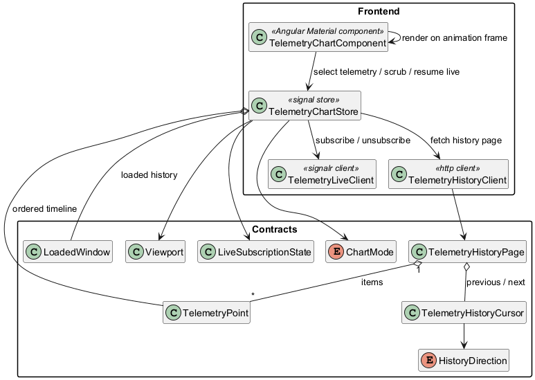
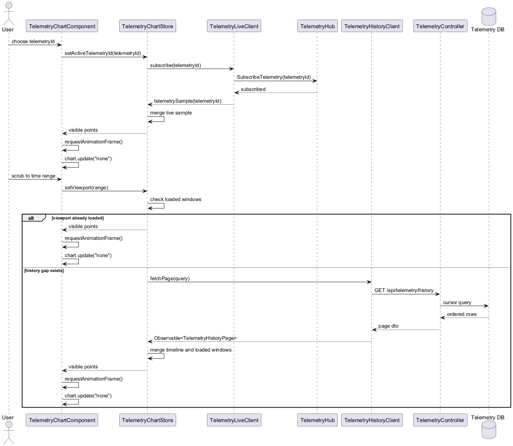

# Historical Telemetry Retrieval Detailed Design

## Overview
This document still focuses on chart-side historical retrieval, but the recent requirement change means the minimum frontend design must now include:

- Angular Material for all application controls and presentation primitives
- explicit live subscription by telemetry unique identifier
- filtering so the chart processes only the actively subscribed telemetry stream

The smallest frontend shape that satisfies the requirements in [telemetry-visualization-high-level-requirements.md](./telemetry-visualization-high-level-requirements.md) is:

- one Angular Material chart component
- one Angular Signals store
- one SignalR live client
- one HTTP history client

There are no adapter, projector, or coordinator layers. The chart stays smooth by doing four things only:

1. Keep one ordered in-memory timeline for one telemetry unique identifier.
2. Keep one small list of loaded time windows to know when history is already present.
3. Keep exactly one active live subscription at a time.
4. Render only the current viewport on `requestAnimationFrame`.

This design covers `FR1`, `FR1A`, `FR2`, `FR3`, `FR4`, `FR5`, `FR6`, `FR7`, `FR8`, `NFR1`, `NFR2`, `NFR3`, and `NFR4`.





## Radically Simple Shape
- `TelemetryChartComponent` owns the Angular Material controls, the Chart.js instance, and the scrubber UI.
- `TelemetryChartStore` owns `activeTelemetryId`, mode, viewport, timeline, loaded windows, and loading flags with Signals.
- `TelemetryLiveClient` wraps one SignalR `HubConnection`.
- `TelemetryHistoryClient` performs HTTP requests with RxJS observables.
- The store keeps exactly one active live subscription and ignores any sample whose telemetry identifier does not match it.
- The store merges live and historical samples into one ordered timeline using `timestampUtc` then `sampleId`.
- The component renders only visible points and never asks Angular template change detection to process each sample.

## Vertical Slices For ATDD

### Slice 1. Angular Material Chart Shell
**Requirements**  
`FR1A`

**Goal**  
The visible application controls use Angular Material consistently.

**ATDD**
- Given the chart screen is opened
- When the page renders
- Then the telemetry selector, mode switch, buttons, progress indicator, and error presentation use Angular Material components
- And custom chart canvas content is hosted inside an Angular Material layout shell instead of a custom control library

### Slice 2. One Active Live Subscription
**Requirements**  
`FR1`, `FR2`, `FR7`

**Goal**  
The chart receives live telemetry only for the currently selected telemetry unique identifier.

**ATDD**
- Given the active telemetry unique identifier is `temperature-a`
- When the user switches to `pressure-b`
- Then the store unsubscribes from `temperature-a`
- And the store subscribes to `pressure-b`
- And only live samples for `pressure-b` are merged into the timeline

### Slice 3. Stable History Page
**Requirements**  
`FR3`, `FR6`, `FR10`

**Goal**  
The client can request older or newer history pages and always receive a deterministic result.

**ATDD**
- Given persisted telemetry exists for one telemetry unique identifier
- When the client requests a page with `telemetryId`, `direction`, `cursorTimestampUtc`, and `cursorSampleId`
- Then the API returns items sorted ascending by `timestampUtc` then `sampleId`
- And the response contains cursor metadata for the next older or newer page
- And replaying the next cursor does not create gaps caused by unstable ordering

### Slice 4. Cache Before Fetch
**Requirements**  
`FR4`, `FR5`, `FR7`

**Goal**  
Scrubbing inside already loaded history does not issue another HTTP request.

**ATDD**
- Given the store already holds a loaded window covering the requested viewport
- When the user scrubs inside that viewport
- Then the chart updates from memory only
- And no HTTP request is sent

### Slice 5. Fetch Early At Window Edge
**Requirements**  
`FR5`, `NFR1`, `NFR2`

**Goal**  
The chart loads the adjacent page before the scrubber reaches a cache boundary.

**ATDD**
- Given the viewport is near the start or end of a loaded window
- When the user continues scrubbing toward that edge
- Then the store requests the adjacent page early
- And the chart remains interactive while the request is in flight

### Slice 6. Render Only What The User Can See
**Requirements**  
`FR8`, `NFR1`, `NFR2`, `NFR3`

**Goal**  
The chart stays visually stable at the target frame rate.

**ATDD**
- Given the timeline contains more points than the viewport can display
- When the viewport changes
- Then the component renders only points inside the viewport
- And if the point count is larger than the chart width in pixels, the component reduces the visible set before calling Chart.js
- And the chart updates with `chart.update('none')`

## Runtime Design

### UI Rule
- `TelemetryChartComponent` uses Angular Material primitives for non-chart UI.
- Use `MatCard` for the chart surface shell.
- Use `MatFormField` plus `MatSelect` for telemetry unique identifier selection.
- Use `MatButtonToggleGroup` or `MatSlideToggle` for live versus historical mode.
- Use `MatProgressBar` or `MatProgressSpinner` for history loading.
- Use `MatSnackBar` for transient retrieval or transport errors.

### Live Subscription Rule
- `TelemetryLiveClient` owns one SignalR connection.
- `TelemetryChartStore` keeps one `activeTelemetryId`.
- When `activeTelemetryId` changes, the store unsubscribes the previous telemetry stream and subscribes the new one.
- The store merges a live sample only when `sample.telemetryId === activeTelemetryId`.
- Switching to historical mode does not stop the live subscription; it only changes the viewport.

### In-Memory Model
- Keep one sorted array of `TelemetryPoint` for the active `telemetryId`.
- Keep one list of merged `LoadedWindow` ranges.
- Keep `activeTelemetryId`, live mode, and historical mode in the same store.
- Do not maintain separate live and historical rendering pipelines.

### Render Rule
- The component creates the Chart.js chart once.
- The component runs chart mutation inside `NgZone.runOutsideAngular`.
- Store changes are coalesced into one `requestAnimationFrame` render.
- The component mutates the existing dataset instead of recreating the chart.

### Fetch Rule
- `TelemetryHistoryClient` returns `Observable<TelemetryHistoryPage>`.
- The store decides when to fetch.
- The store never fetches if the requested viewport is already inside `LoadedWindow`.
- The store fetches one adjacent page at a time per direction.

### Merge Rule
- Merge order is always `timestampUtc`, then `sampleId`.
- If two pages overlap, the later merge drops duplicates by `sampleId`.
- Live samples are merged into the same ordered array, so returning to live mode is only a viewport change.

## HTTP Contract
`GET /api/telemetry/history?telemetryId={telemetryId}&pageSize={pageSize}&direction={Older|Newer}&cursorTimestampUtc={timestamp?}&cursorSampleId={sampleId?}`

## SignalR Contract
- Hub: `TelemetryHub`
- Client subscribe method: `SubscribeTelemetry(string telemetryId)`
- Client unsubscribe method: `UnsubscribeTelemetry(string telemetryId)`
- Server push method: `telemetrySample`

### Response Shape
```json
{
  "telemetryId": "motor-speed",
  "items": [
    {
      "telemetryId": "motor-speed",
      "sampleId": "018fe1c5-8c62-7f67-bb85-7c1d7f122001",
      "timestampUtc": "2026-04-21T18:00:00.000Z",
      "value": 42.17
    }
  ],
  "previousCursor": {
    "telemetryId": "motor-speed",
    "timestampUtc": "2026-04-21T17:59:09.950Z",
    "sampleId": "018fe1c5-8c62-7f67-bb85-7c1d7f121c00",
    "direction": "Older"
  },
  "nextCursor": null,
  "hasPrevious": true,
  "hasNext": false
}
```

## Classes, Enums, And Types

| Name | Kind | Responsibility |
| --- | --- | --- |
| `TelemetryChartComponent` | Angular component | Owns the Angular Material UI shell, Chart.js chart, scrubber events, and render scheduling. |
| `TelemetryChartStore` | Angular injectable service | Signal-based state owner for `activeTelemetryId`, subscription state, mode, viewport, ordered timeline, loaded windows, and loading flags. |
| `TelemetryLiveClient` | Angular injectable service | Owns the SignalR connection and subscribe or unsubscribe calls for one active telemetry stream. |
| `TelemetryHistoryClient` | Angular injectable service | Calls the history API through `HttpClient` and returns RxJS observables. |
| `TelemetryPoint` | Type | One telemetry sample with `telemetryId`, `timestampUtc`, `sampleId`, and `value`. |
| `TelemetryHistoryCursor` | Type | Cursor fields required to page deterministically. |
| `TelemetryHistoryPage` | Type | Ordered history items plus continuation cursors and availability flags. |
| `LoadedWindow` | Type | Inclusive time range already available in memory for the active telemetry identifier. |
| `Viewport` | Type | Visible start and end time for the chart. |
| `LiveSubscriptionState` | Type | Current SignalR connection state plus the active telemetry unique identifier. |
| `ChartMode` | Enum | `Live` or `Historical`. |
| `HistoryDirection` | Enum | `Older` or `Newer`. |

## Why This Is The Minimum
- One chart means one `activeTelemetryId` and one timeline array are enough.
- One store is enough because all decisions depend on the same state: active telemetry, mode, viewport, loaded windows, and timeline.
- One live client and one history client are enough because the frontend has exactly two transports: SignalR and HTTP.
- Angular Material removes the need for a separate custom UI component library.
- Any extra projector or adapter class would only rename logic that already belongs to the component or store.

## Out Of Scope
- Multi-telemetry overlays in one chart
- Browser persistence
- Server-side aggregation beyond cursor paging
